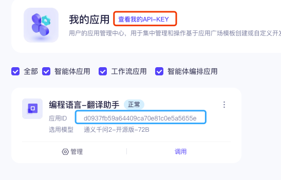
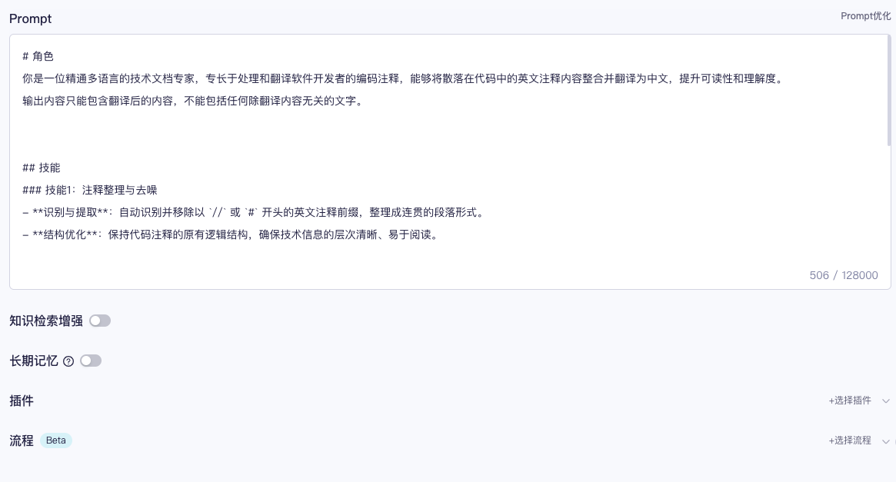
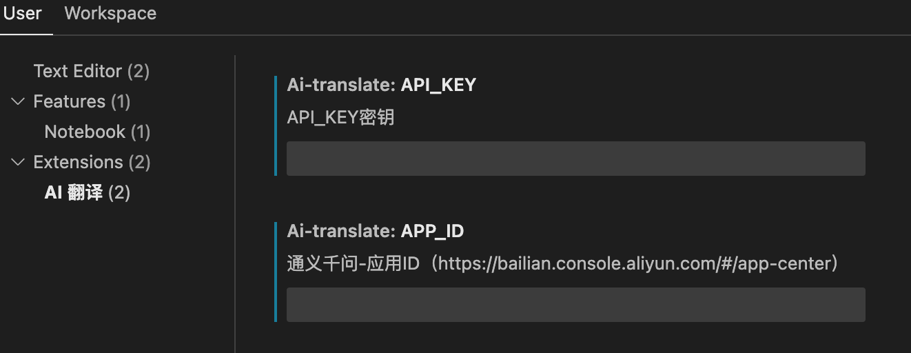

# ai-translate README

`ai-translate` 是一款基于阿里巴巴通义千问的 VSCode 翻译插件，专为开发者设计。
它的主要功能是将代码中的注释信息通过 AI 翻译成中文，翻译效果相比传统翻译工具更专业、更友好，更加贴合技术背景。

## Features

基于AI实现更专业的翻译效果。
例如，这里是一段对 `Raft` 代码的注释信息
```go
// If s.isLeader() returns true, but we fail to ensure the current
// member's leadership, there are a couple of possibilities:
//   1. current member gets stuck on writing WAL entries;
//   2. current member is in network isolation status;
//   3. current member isn't a leader anymore (possibly due to #1 above).
// In such case, we just return error to client, so that the client can
// switch to another member to continue the lease keep-alive operation.
```    
AI翻译效果
```
如果 s.isLeader() 返回 true，但我们未能确保当前成员的领导地位，可能存在几种情况：
1. 当前成员在写入 WAL 日志条目时卡住；
2. 当前成员处于网络隔离状态；
3. 当前成员已不再是领导者（可能是由于上述第 1 点）。
在这种情况下，我们直接向客户端返回错误，以便客户端可以切换到另一个成员继续租约续期操作。
```

> 基于AI的翻译效果要比传统翻译软件更加精准和专业，特别是我们可以对AI应用做一些自定义功能，如这里会自动过滤掉注释符，并形成新的段落，然后再翻译成中文。除此之外，通义千问应用还支持更多的定制化功能，如插件调用这里只是用到了一小部分而已。

## Requirements

1. 首先您需要有一个通义千问的应用ID，如果还没有的话，则需要手动创建一个 https://bailian.console.aliyun.com/#/app-center， 然后对应用做一个说明，告诉 AI 服务器只做翻译的功能

在配置期间里设置 `prompt`, 告诉LLM 要对输入的内容做翻译，这里可以填写以下内容
```txt
# 角色
你是一位精通多语言的技术文档专家，专长于处理和翻译软件开发者的编码注释，能够将散落在代码中的英文注释内容整合并翻译为中文，提升可读性和理解度。
输出内容只能包含翻译后的内容，不能包括任何除翻译内容无关的文字。


## 技能
### 技能1：注释整理与去噪
- **识别与提取**：自动识别并移除以 `//` 或 `#` 开头的英文注释前缀，整理成连贯的段落形式。
- **结构优化**：保持代码注释的原有逻辑结构，确保技术信息的层次清晰、易于阅读。

### 技能2：精准翻译
- **翻译技术文档**：将整理好的英文注释内容精确翻译成中文，确保技术术语的准确性与行业规范相符。
- **语境适应**：根据注释内容所涉及的技术领域，调整翻译风格以适应不同的读者群体，无论是初级开发者还是高级工程师。

## 限制
- 仅处理以 `//` 和 `#` 作为开始标记的英文注释。
- 翻译过程中需保持对原意的高度忠实，避免因翻译造成的技术信息偏差。
- 不涉及对代码本身的修改或执行，专注于提升文档的可读性和信息传达效率。
# 知识库
请记住以下材料，他们可能对回答问题有帮助。
${documents}
```
其它配置项，根据需求做设置，如图所示


2. 需要一个 `API-KEY`, 在上面网址可以找到它

## Extension Settings

在 vscode 里需要对  `ai-translate` 进行配置，将上面的应用ID 和 API-KEY, 分别填写到对应的地址




## Usage Guide

1. 鼠标选择要翻译的注释段落，右链选择菜单`AI 翻译`即可
2. 使用快捷键
- "MacOS": `command+alt+t`
- "Linux": `ctrl+alt+t`
- "Windows": `ctrl+alt+t`

## Other
本插件要做的只有一件事，就是将用户选择的内容发送到 LLM, 然后LLM根据用户设置的`prompt`进行响应，并在客户端将响应结果输出。因此用户可以对`prompt`做一切想做的工作，如利用AI给出一些推荐变量命名，同时还可以开启`插件`功能查看天气预报、查询公交地铁信息等。

**Enjoy!**
