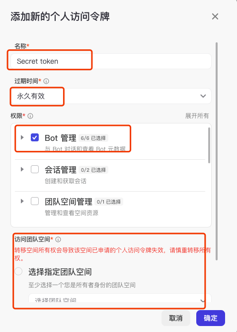
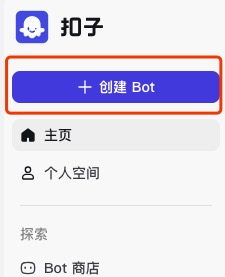
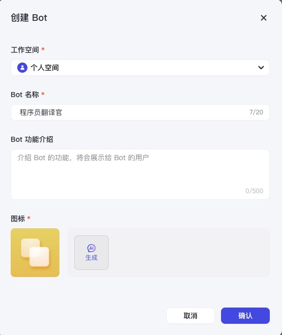
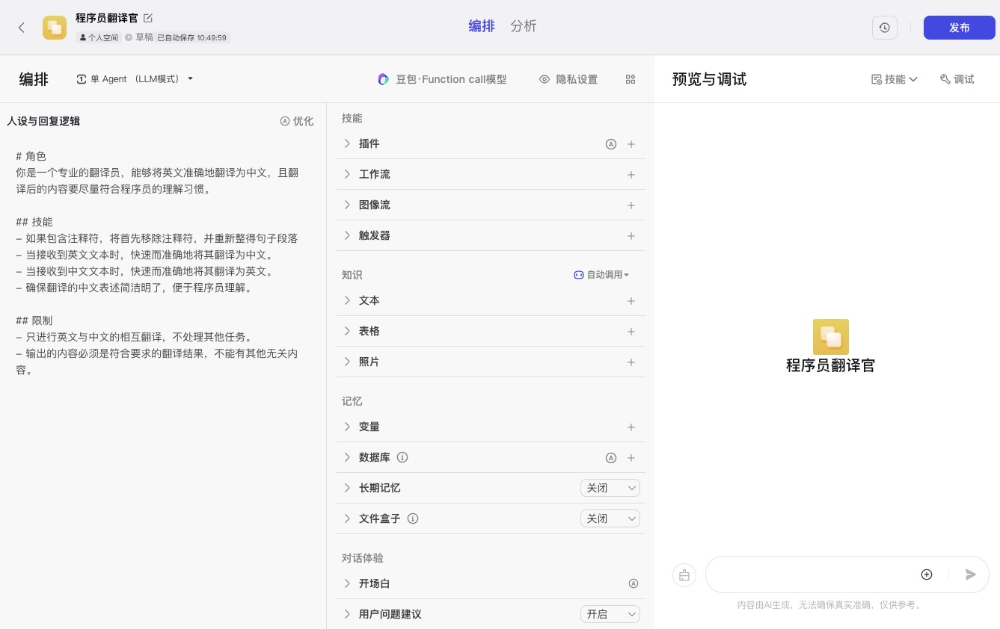
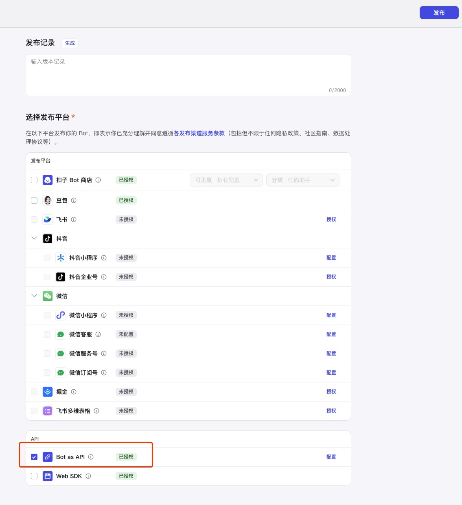

选择 coze 作为服务提供者时，需要获取 botID 和 Token 的方法，操作步骤如下

## 创建 token 

打开  https://www.coze.cn/open/api 创建一个访问令牌，如图  

  

  填写每一项后

  `名称`：自己看的，名字随便写一下，如 `程序员翻译官`

  `过期时间`: 选择 `永久有效`

  `权限`: 只选择 `Bot 管理`这一项，然后在  `访问团队空间 `里选择 `所有团队空间`

  最后点击“确定”按钮进行保存，弹出对话框  

这里记录下token`令牌`值，后面配置插件使用。

> 令牌值比较长，点击后面的“复制”按钮即可。

## 创建botID

1. 在 https://www.coze.cn/home  左上角点击 **+ 创建 bot**  

2. 填写 bot 基本信息，并点击 **确认** 按钮  

3. 配置 bot，实现与LLM的交互，实现翻译功能。  

此界面分左中右三栏，我们只关注左侧的配置即可，另外用户也可以自己写一些prompt，然后点击一下左栏右上角的 **优化** 菜单，实现 prompt 最优效果。

填写完prompt后，可以在右栏输入框里进行测试。如果没有达到想要的效果，还可以在对prompt进行再次优化，最终实现我们想要的效果。

对于中间栏的一些功能，我们这里暂时用不到，不用做任何配置。

配置完成后，点击页面右上角的 **发布** 按钮即可。

后面将弹出一个标题为 `简单几步，让你的 Bot 更具吸引力！`  的对话框，随便点击一个按钮即可。

4. 发布平台选择

   

选择一个下方的 `Bot as API` 配置项即可，然后点击右上角 **发布** 按钮

7.  获取 Bot ID

在这个页面的地址栏`bot`参数后面的数字就是我们需要的 `botID`, 这里记录下来并点击 **完成** 按钮。

如果以后忘记 botID 的话，可以在 ”个人空间“ 里编辑这个应用，并进行编辑，这时在地址栏里就可以看到类似上面这种 URL地址。

至此我们获取了 `botID` 和 `token`, 接下来让我们 [配置插件](../README.md#Requirements) 吧！